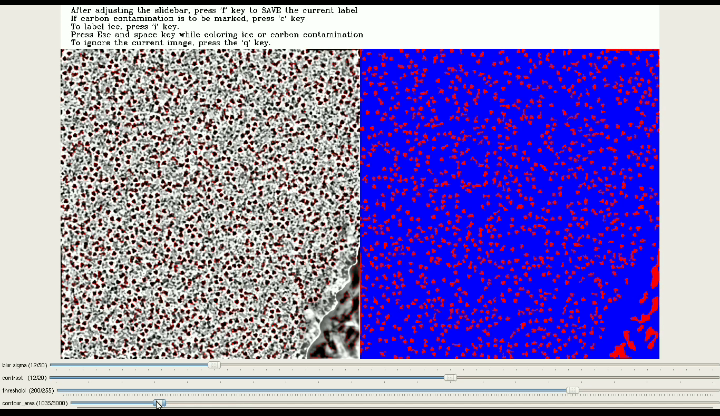
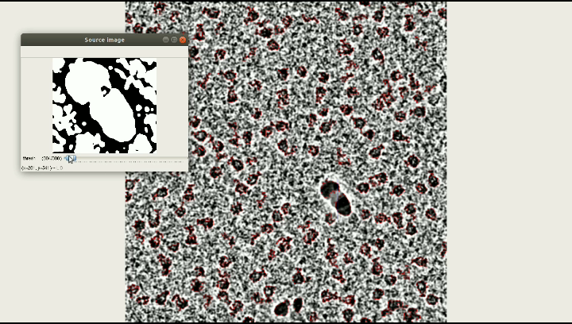

# CASSPER: A Semantic Segmentation based Particle Picking Algorithm for Single Particle Cryo-Electron Microscopy

This repo contains the files to run the **CASSPER** semantic segmentation suite. 

#### Labeling tool

 The mrc files to be labeled are to be put into a folder.
* The program can be run as `python label_generator.py -i mrc_directory -o output_directory`
* `mrc_directory` specifies the location of the folder containing all the mrc files
* `output_directory` specifies the location to which the labels are to be stored
* Adjust the `blur_sigma` and `contrast` trackbars untill the protein and ice particles are clearly visible.
* Now adjust the `threshold` and `contour_area` trackbars to get the labels of the desired protien particles only.
----

### Instruction manual

#### Mouse control

Button | Description | 
--- | --- |
Left | Draw box while labeling ice
Left | To click on the four corners of the carbon contamination

#### Keyboard Shortcuts

Shortcut | Description | 
--- | --- |
<kbd>i</kbd> | color ice |
<kbd>c</kbd> | color carbon contamination |
<kbd>f</kbd> | save the current label |
<kbd>q</kbd> | ignore the current micrograph |
<kbd>Space</kbd> | save the current ice patch while labeling ice |
<kbd>ESC</kbd> | Finish labeling ice patches |
<kbd>ESC</kbd> | Finish labeling while carbon contamination annotation |
----


## Folder and file Structure
```
builders/  
frontends/  
models/  
mrc_files/ 
utils/
protein_1/  
    └───labels/  
    └───Pfiles.txt  
    └───Trfiles.txt  
    └───class_dict.csv  
protein_2/  
    └───labels/  
    └───Pfiles.txt  
    └───Trfiles.txt  
    └───class_dict.csv  

predict2.py  
ProtiPr.py  
ProtiSem.cpython-36m-x86_64-linux-gnu.so  
PSPred.py  
PSTest.py  
PSTrain.py  
scale_write_img.py  
test2.py  
train2.py  
Train8.sh  
```  
